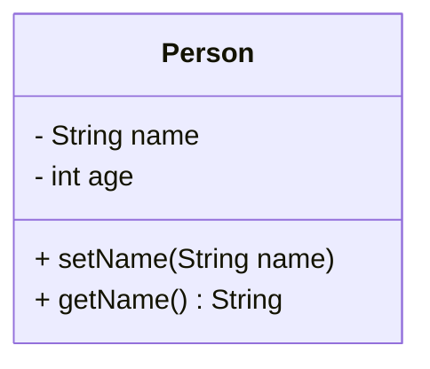

# Mermaid Class Diagram to Java Code Generator

## 簡介
此專案是一個 Java 應用程式，可將 Mermaid 類圖 (class diagram) 轉換為對應的 Java 類別代碼。它讀取 Mermaid 語法的類圖，解析其中的類別、屬性及方法，並生成 Java 檔案。

## 功能特色
- 讀取 Mermaid 類圖文件。
- 解析類別名稱、屬性與方法。
- 生成對應的 Java 類別。
- 支援 `public`、`private` 屬性與方法。
- 自動補全 `getter` 與 `setter` 方法。

## 安裝與執行

### 1. 編譯程式
請確保你的環境已安裝 Java，然後使用以下指令進行編譯：
```sh
javac CodeGenerator.java
```

### 2. 執行程式
執行時需要提供 Mermaid 類圖文件名稱：
```sh
java CodeGenerator input.mmd
```
`input.mmd` 為 Mermaid 類圖的檔案。

## 程式架構

### `CodeGenerator`
- 主程式入口，負責讀取輸入文件並呼叫 `Parser` 解析內容。

### `Parser`
- 將 Mermaid 類圖拆分為不同的類別，並交由 `MakeJavaFromMermaid` 生成 Java 代碼。

### `MakeJavaFromMermaid`
- 解析類別名稱、屬性及方法。
- 依照規則判斷是屬性或方法，並生成對應的 Java 語法。

### `JavaOutputWriter`
- 負責將生成的 Java 代碼寫入對應的 `.java` 文件。

## Mermaid 語法範例

### `input.mmd`


### 生成的 Java 代碼 (`Person.java`)
```java
public class Person {
    private String name;
    private int age;

    public void setName(String name) {
        this.name = name;
    }
    
    public String getName() {
        return name;
    }
}
```

## 注意事項
- Mermaid 類圖語法需正確，否則解析可能失敗。
- 目前不支援複雜關聯 (如繼承、介面等)，僅解析基本類別。
- 生成的 Java 代碼可能需要手動調整，以符合實際需求。

